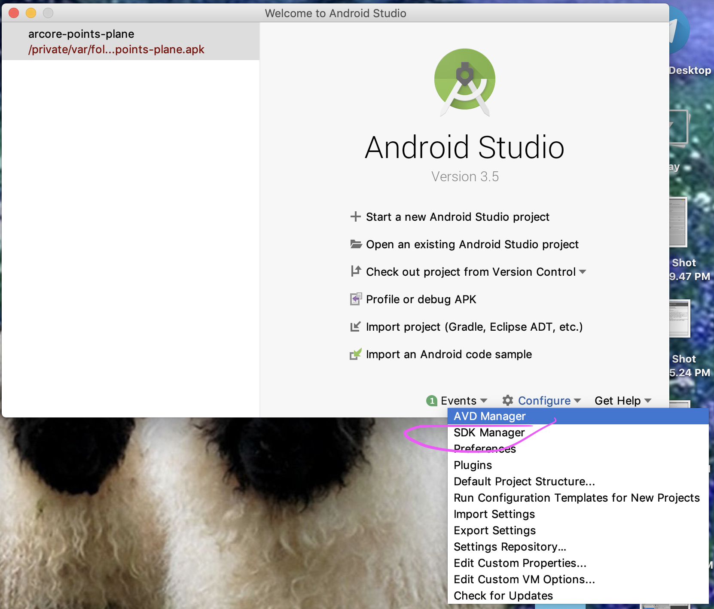
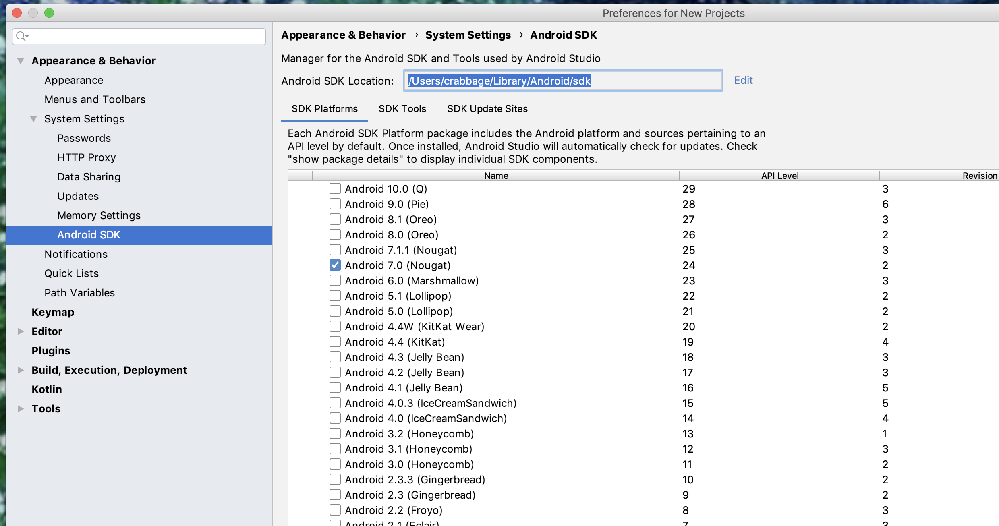
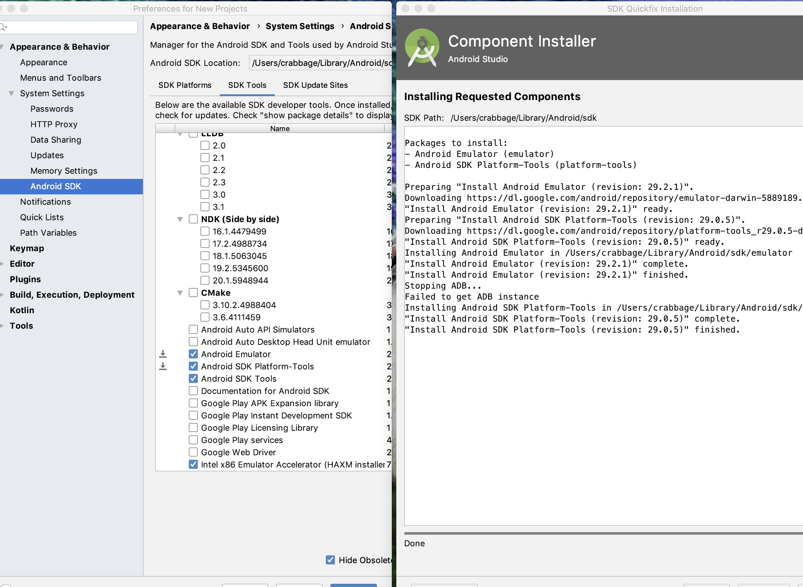
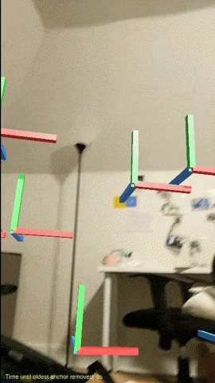
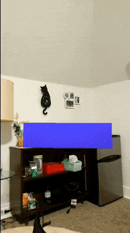
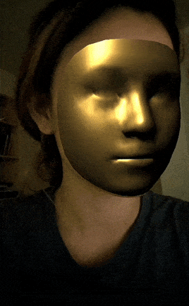
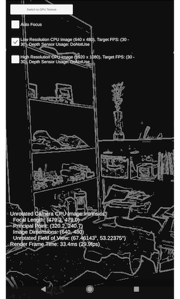

# ARCore Educational Templates

## About
This repository contains a collection of simple template projects and tutorials for developing augmented reality (AR) Android apps using Unity and Google's ARCore technology. These materials are intended for students with introductory programming experience, and introductory familiarity with Unity. 

**For a similar repository of ARKit templates and tutorials for Apple iOS devices, [please click here](https://github.com/CreativeInquiry/ARKit-Educational-Templates).**

These projects and their documentation were developed in October 2019 by [Connie Ye](https://github.com/khanniie) ([@crabbage_](https://twitter.com/crabbage_)), with support from the [Frank-Ratchye STUDIO for Creative Inquiry](http://studioforcreativeinquiry), for undergraduate media arts courses taught by [Golan Levin](http://flong.com) at Carnegie Mellon University. Portions of these tutorials have been adapted from the ARCore site (Creative Commons Attribution 4.0 License), and the Github hosted code samples (Apache 2.0 License). We welcome your contributions and corrections!

## Table of Contents
1. [Getting Started](#getting-started)
4. [ARCore in Unity](#arcore-in-unity)
    - [General Notes](#general-notes)
    - [Instant Preview](#instant-preview)
    - [Demo: HelloAR](#demo-helloar)
    - [Demo: Add Anchors Everywhere](#demo-add-anchors-everywhere)
    - [Demo: Augmented Images](#demo-augmented-images)
    - [Demo: Change Based on Distance](#demo-change-based-on-distance-from-camera)
    - [Demo: Face Mesh](#demo-face-mesh)
    - [Demo: Augmented Faces](#demo-augmented-faces)
    - [Demo: Computer Vision](#demo-computer-vision)
    - [Demo: Object Manipulation](#demo-object-manipulation)

# Getting started
See the official [Unity ARCore Quickstart page](https://developers.google.com/ar/develop/unity/quickstart-android) for instructions on setup.

You can download their official package from their site, or clone this repository with the below command, which is a version of their package that has been modified to include a few more examples (AddAnchorsEverywhere, ChangeBasedOnDistance, FaceMesh). If you clone this repository, the folder to open with Unity Hub is NOT the root directory, but the folder titled `arcore-unity-sdk-1.13.0`

`git clone https://github.com/khanniie/arcore-github`

### JDK/SDK Troubleshooting
If, when building, you run into any trouble that looks like it has to do with the JDK or SDK version, go to `Unity->Preferences->External Tools`
For the JDK, you should enable `JDK installed with Unity` (you need to have installed this JDK module under `Android Build Support` when you installed your version of Unity. If you didn't you can go to Unity Hub -> Installs -> Add Module).

Here are some steps for installing the correct SDK version (24).
1. Install android studio.
2. Open Android Studio, click on the `Configure` button, and open `SDK manager`

3. Make sure you have version 24 installed; install if not.

4. Make sure all SDK tools are updated (`sdk manager->sdk tools`).

5. In Unity, open `Preferences->External Tools`, uncheck `Android SDK tools installed by Unity` and set the SDK path to be whatever is specified in your Android Studio SDK Manager pane under `Android SDK Location`.

# ARCore in Unity

## General Notes
ARCore is well documented by Google at [https://developers.google.com/ar/develop/unity](https://developers.google.com/ar/develop/unity).
This repository is a modified version of their SDK v1.13.0; below, the sample scenes that have been added have been documented here, while sample scenes built by Google contain links to their pages on the website.

Note that there is no specific lighting estimation sample scene, but [it is a useful feature that may be worth looking into](https://developers.google.com/ar/develop/unity/light-estimation).

___________________

## Instant Preview

It is highly recommended that you use Instant Preview to skip the build process and test ARCore apps instantly on your phone. Click Play in Unity to preview your app using real input and output from your phone. Please see the [official page for instructions and limitations.](https://developers.google.com/ar/develop/unity/instant-preview) Some features will not work in Instant Preview and require being built, but warnings will be logged to the Unity console if you attempt to use an unsupported feature in Instant Preview.

___________________

## Demo: HelloAR

*Image from Google ARCore Documentation Note: current demos use a different object than the android character.*

Visualizes AR "points of interest" using a point cloud, draws planes, and allows the user to place objects upon the plane by tapping on the plane.

See ARCore's Tutorial page for [HelloAR](https://developers.google.com/ar/develop/unity/tutorials/hello-ar-sample).

### Possible Next Steps
- Try changing out the Prefab Object with your own 3d object. [To make a prefab](https://docs.unity3d.com/Manual/CreatingPrefabs.html), drag and drop a scene gameobject into the project folder view.

___________________

## Demo: Add Anchors Everywhere

Places a GameObject upon user click/touch. The oldest GameObject will be deleted after "timeuntilremove" number of seconds, which is set to 10 as the default.

### Scripts
- **AddAnchorsEverywhere.cs:** Clones the specified PrefabOject a distance of distanceFromCamera meters forwards, tracks existing objects, and then deletes the oldest one after 10 seconds of inactivity. See inline comments for more specific implementation details. Note that the tap on the screen does not affect the position of the result on the screen, it is merely a trigger. The clone's position is calculated based on the main camera.

### Possible Next Steps
- Try changing out the Prefab Object with your own 3d object in AddAnchorsEverywhere! [To make a prefab](https://docs.unity3d.com/Manual/CreatingPrefabs.html), drag and drop a scene gameobject into the project folder view.

___________________

## Demo: Augmented Images

*Image from Google ARCore Documentation. Left: Reference Image, Right: AR superimposed 3D object*

Augmented Images in ARCore lets you build AR apps that can respond to 2D images in the user's environment. You provide a set of reference images, and ARCore tells you where those images are physically located in the world.

See ARCore's Documentation page for [Augumented Images](https://developers.google.com/ar/develop/unity/augmented-images).

___________________

## Demo: Change Based on Distance From Camera

The cube in the scene changes size, color and rotation (in the second gif) based on the distance between it and the camera.

### Scripts
- **ChangeBasedOnDistance.cs:** Calculates the distance between the cube and the main camera, and sets the cube's rotation/size/color according to that value.

### Possible Next Steps
- Consider remapping the values from distance to size/color/rotation differently.
- Change something other than size/color/rotation.
- Use a different object.
- Instead of using the distance as a gradient, set a threshold value at which an event is triggered.

___________________

## Demo: Face Mesh

Places a mesh upon the face.

See documentation for making a [face mesh](https://developers.google.com/ar/develop/unity/augmented-faces/developer-guide).

___________________

## Demo: Augmented Faces
 
*Image from Google ARCore Documentation*

Augmented Faces allows your app to automatically identify different regions of a detected face, and use those regions to overlay assets such as textures and models in a way that properly matches the contours and regions of an individual face.

See ARCore's Documentation page for [Augmented Faces](https://developers.google.com/ar/develop/unity/augmented-faces).

___________________

## Demo: Computer Vision

Runs computer vision upon the input camera image.
___________________

## Demo: Object Manipulation

A verion of Google's HelloAR app where you can also modify the objects that you place upon the plane.

See ARCore's Tutorial page for [object manipulation](https://developers.google.com/ar/develop/unity/tutorials/object-manipulation-sample).

___________________

## Demo: Cloud Anchors

Use Cloud Anchors to create multiplayer or collaborative AR experiences that Android and iOS users can share. Using Cloud Anchors, your app lets users add virtual objects to an AR scene. Multiple users can then view and interact with these objects simultaneously from different positions in a shared physical space.

See ARCore's Documentation page for [Cloud Anchors](https://developers.google.com/ar/develop/unity/cloud-anchors/quickstart-unity-android).
